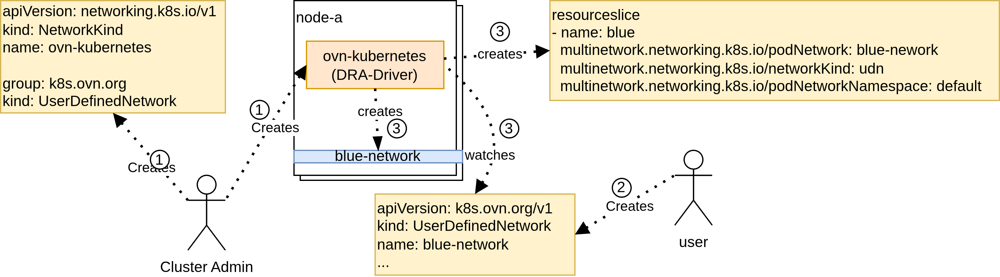
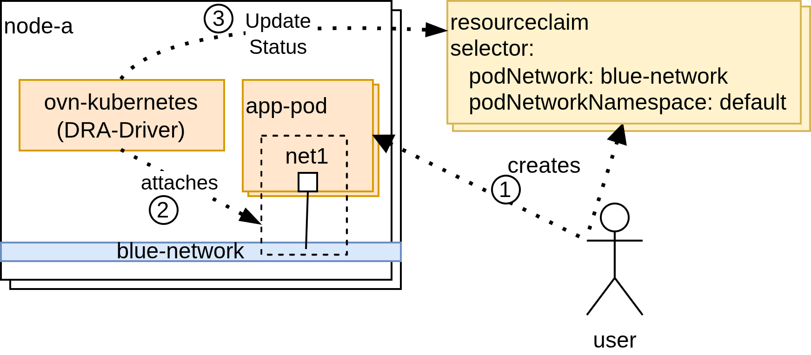

# NetworkKind

## Proposal

`NetworkKind` defines a mapping between a Kubernetes-recognized network kind and an implementation-specific pod network object type. It does not define networking behavior or semantics. Instead, it provides a classification and discovery mechanism that allows Kubernetes APIs and controllers to recognize and integrate multiple pod networks.

`NetworkKind` is a cluster-scoped resource. It is expected to be installed by the cluster administrator together with a pod network implementation.

A `NetworkKind` references a specific Group/Kind (GK) and multiple `NetworkKind` objects cannot reference the same GK. Any object matching this GK is considered a pod network instance belonging to that `NetworkKind`. As a result, a pod network instance belongs to exactly one `NetworkKind`. Users create implementation-defined pod network objects, while Kubernetes uses NetworkKind to recognize them as pod networks. A pod network is identified by its name, namespace (if applicable), and its associated `NetworkKind`.

A `NetworkKind` is immutable once created, so the Group/Kind referenced by a `NetworkKind` cannot be changed. A `NetworkKind` cannot be deleted while at least one pod network object belonging to that `NetworkKind` exists. A `NetworkKind` reports an `ImplementationTypeReady` status condition indicating whether the CRD referenced by its `ImplementationType` exists and is ready in the cluster.

The presence of at least one `NetworkKind` object indicates that pod network (multi-network) functionality is available in the cluster.

```go
import (
  metav1 "k8s.io/apimachinery/pkg/apis/meta/v1"
)

// NetworkKind describes a kind of pod networks implemented
// by a specific controller and represented by implementation-defined objects.
type NetworkKind struct {
  metav1.TypeMeta
  // Standard object's metadata.
  // More info: https://git.k8s.io/community/contributors/devel/sig-architecture/api-conventions.md#metadata
  // +optional
  metav1.ObjectMeta
  // spec is the desired state of the NetworkKind.
  // More info: https://git.k8s.io/community/contributors/devel/sig-architecture/api-conventions.md#spec-and-status
  // +optional
  Spec NetworkKindSpec
  // status is the current state of the NetworkKind.
  // More info: https://git.k8s.io/community/contributors/devel/sig-architecture/api-conventions.md#spec-and-status
  // +optional
  Status NetworkKindStatus
}

// NetworkKindSpec describes how pod network objects of this kind are identified.
type NetworkKindSpec struct {
  // ImplementationType identifies the API type of the pod network objects
  // belonging to this NetworkKind.
  // The ImplementationType may reference either a namespace-scoped or a cluster-scoped resource type.
  // +kubebuilder:validation:XValidation:rule="self == oldSelf",message="spec.ImplementationType is immutable"
  ImplementationType metav1.GroupKind

  // DefaultNetworkKind indicates whether this NetworkKind is the default for the cluster.
  // If true, this NetworkKind is the default for the cluster and will be used when no specific NetworkKind is specified.
  // If false, this NetworkKind is not the default for the cluster and will only be used when explicitly requested.
  // If not specified, the default is false.
  // +kubebuilder:validation:XValidation:rule="self == oldSelf",message="spec.DefaultNetworkKind is immutable"
  // +optional
  DefaultNetworkKind *bool
}

// NetworkKindStatus describes the observed state of the NetworkKind.
type NetworkKindStatus struct {
  // conditions is the list of conditions for this NetworkKind.
  // +optional
  // +listType=map
  // +listMapKey=type
  Conditions []metav1.Condition

  // DefaultNetworkKind indicates whether this NetworkKind has been selected to be the default for the cluster.
  // When multiple NetworkKinds have spec.DefaultNetworkKind set to true, the candidate selected as default 
  // is the oldest NetworkKind determined by metadata.creationTimestamp.
  // If another NetworkKind is already the active default NetworkKind, this field will be false even if 
  // spec.DefaultNetworkKind is true, and a condition will be set to indicate that the default NetworkKind 
  // is already set.
  // +optional
  DefaultNetworkKind *bool
}

// Well-known condition types for NetworkKinds.
const (
  // NetworkKindConditionImplementationTypeReady indicates whether the CRD referenced by the
  // NetworkKind's ImplementationType exists and is ready in the cluster.
  NetworkKindConditionImplementationTypeReady = "ImplementationTypeReady"

  // NetworkKindConditionDefaultNetworkKind indicates whether this NetworkKind has been selected 
  // to be the default for the cluster.
  // This condition is added only when the spec.DefaultNetworkKind is true.
  NetworkKindConditionDefaultNetworkKind = "DefaultNetworkKind"
)

// Well-known condition reasons for NetworkKinds.
const (
  // NetworkKindReasonCRDNotFound in the ImplementationTypeReady condition indicates
  // that the CRD referenced by the NetworkKind's ImplementationType does not exist
  // in the cluster.
  NetworkKindReasonCRDNotFound string = "CRDNotFound"
  // NetworkKindReasonCRDNotReady in the ImplementationTypeReady condition indicates
  // that the CRD referenced by the NetworkKind's ImplementationType exists but is not
  // yet ready.
  // Ready means that the CRD has been established, its names have been accepted and it contains
  // the required categories.
  NetworkKindReasonCRDNotReady string = "CRDNotReady"
  // NetworkKindReasonMissingRBAC in the ImplementationTypeReady condition indicates
  // that the necessary RBAC permissions are missing for the CRD referenced by the
  // NetworkKind's ImplementationType.
  NetworkKindReasonMissingRBAC string = "MissingRBAC"
  // NetworkKindReasonCompliant in the ImplementationTypeReady condition indicates
  // that the CRD referenced by the NetworkKind's ImplementationType exists and is ready.
  NetworkKindReasonCompliant string = "Compliant"

  // NetworkKindReasonDefaultNetworkKindSet in the DefaultNetworkKind condition indicates
  // that this NetworkKind has been selected to be the default for the cluster.
  NetworkKindReasonDefaultNetworkKindSet string = "DefaultNetworkKindSet"
  // NetworkKindReasonDefaultNetworkKindAlreadySet in the DefaultNetworkKind condition indicates 
  // that this NetworkKind cannot be set as the default for the cluster because another 
  // NetworkKind is already set as the default.
  NetworkKindReasonDefaultNetworkKindAlreadySet string = "DefaultNetworkKindAlreadySet"
)
```

A pod network implementation must act as a Dynamic Resource Allocation (DRA) driver to conform to this design. The implementation is responsible for advertising each pod network instance as one or more devices via ResourceSlices. Each advertised device represents the ability to attach workloads to the corresponding pod network.

A ResourceClaim acts as the mechanism for attaching pods to pod networks. Users create requests in the ResourceClaim to select a specific pod network. The pod network implementation is responsible for allocating devices to satisfy these requests and for reporting the attachment status of workloads through the ResourceClaim device status.

Cluster administrators control how users may attach to pod networks by defining DeviceClass objects. Device classes can constrain which devices are selectable, allowing administrators to enforce policies such as limiting access to particular pod networks.

Each DRA driver manages the full lifecycle of devices representing pod network attachments, including allocation, deallocation, and updates to device attributes. This design does not interpret the semantics of these devices, it relies solely on standard device attributes and the device status to enable discovery, selection, and attachment of pod networks.

A pod network implementation may manage multiple `NetworkKind` objects and multiple types of pod networks. Multiple pod network implementations may manage the same `NetworkKind` or pod network type. In such cases, the implementations are responsible for coordinating among themselves (for example, using controller fields or labels). These interactions do not impact the design provided by `NetworkKind`.

### Resource Attributes

To integrate pod networks with Dynamic Resource Allocation (DRA), this proposal defines three new standard device attributes. These attributes allow `ResourceClaims` to select specific pod networks and allow the system to identify devices that attach workloads to a given pod network.

A device that attaches a workload to a pod network must report the associated ResourceClaim device status with a reference to the pod network in its `data` field. The relationship between an advertised device and a pod network is exposed via the device attributes in the corresponding ResourceSlice.

```golang
const (
  // StandardDeviceAttributePrefix is the prefix used for standard device attributes.
  StandardDeviceAttributePrefix = "multinetwork.networking.k8s.io" 

  // StandardDeviceAttributePodNetwork is a standard device attribute name
  // which describes a pod network.
  // The value is a string value referring to the name of an object from the GK defined in the 
  // StandardDeviceAttributeNetworkKind attribute.
  StandardDeviceAttributePodNetwork resourceapi.QualifiedName = StandardDeviceAttributePrefix + "/" + "podNetwork"
  // StandardDeviceAttributePodNetworkNamespace is a standard device attribute name
  // which describes the namespace of a pod network.
  // The value is a string value referring to the namespace of a pod network object.
  // The attribute is optional for the NetworkKind pointing to a non-namespaced GK.
  // The attribute is mandatory for the NetworkKind pointing to a namespaced GK.
  StandardDeviceAttributePodNetworkNamespace resourceapi.QualifiedName = StandardDeviceAttributePrefix + "/" + "podNetworkNamespace"
  // StandardDeviceAttributeNetworkKind is a standard device attribute name
  // which describes a NetworkKind.
  // The value is a string value referring to an existing NetworkKind object.
  StandardDeviceAttributeNetworkKind resourceapi.QualifiedName = StandardDeviceAttributePrefix + "/" + "networkKind"
)
```

### Identification of a Pod Network

When a device representing a pod network attachment is allocated to a workload, the pod network implementation (acting as a DRA driver) reports the attachment details in the `ResourceClaim` device status.

To allow Kubernetes APIs and controllers to identify which pod network an interface is attached to without requiring them to query and join `ResourceSlice` objects, conforming DRA drivers populate the `data` field of the allocated device entry with a `PodNetwork` structure.

```go
// PodNetwork identifies a specific pod network instance.
type PodNetwork struct {
  // Kind identifies the NetworkKind responsible for the pod network.
  // +optional
  Kind string `json:"kind,omitempty"`

  // Name identifies the pod network object.
  Name string `json:"name"`

  // Namespace identifies the namespace of the pod network object.
  // Optional if the pod network object is a non-namespaced resource.
  // +optional
  Namespace *string `json:"namespace,omitempty"`
}
```

In addition to the `data.podNetwork` reference, the driver reports the network interface connection details in the standard `networkData` field (including interface name, hardware address, and assigned IPs).

Here is an example `ResourceClaim` status reporting the allocated device:

```yaml
apiVersion: resource.k8s.io/v1
kind: ResourceClaim
metadata:
  name: blue-network-attachment
spec:
...
status:
  allocation:
    devices:
      results:
      - device: blue-network-resource
        driver: udn.ovn-kubernetes.io
        pool: kind-worker
        request: blue-network
        shareID: 8e7acdf9-0290-4ecd-a801-a654b021d2b7
  devices:
  - data:
      podNetwork:
        kind: userdefinednetwork
        name: blue-network
        namespace: default
    device: blue-network-resource
    driver: udn.ovn-kubernetes.io
    networkData:
      hardwareAddress: 00:01:ec:84:fb:51
      interfaceName: net1
      ips:
      - 10.10.1.2/24
    pool: kind-worker
    shareID: 8e7acdf9-0290-4ecd-a801-a654b021d2b7
```

This self-contained reporting model ensures that controllers (e.g. EndpointSlice, network policy...) can unambiguously determine the network identity directly from the `ResourceClaim` status, without being affected by subsequent modifications to or deletions of `ResourceSlice` objects.

### CustomResourceDefinition Category

Without a common `PodNetwork` API, there is no single resource type that represents all pod networks across implementations. Each implementation defines its own CustomResourceDefinition, so discovering all pod networks in a cluster requires knowing every implementation-specific type.

To address this, pod network implementations must register their CRD under the `podnetwork` and `podnetworks` categories. CRD categories allow `kubectl` to aggregate resources of different types under a single alias, enabling users to list all pod networks across all implementations with a single command: `kubectl get podnetworks`.

Below is an example CRD including the required `categories`:
```yaml
apiVersion: apiextensions.k8s.io/v1
kind: CustomResourceDefinition
metadata:
  name: userdefinednetworks.k8s.ovn.org
spec:
  group: k8s.ovn.org
  names:
    kind: UserDefinedNetwork
    listKind: UserDefinedNetworkList
    plural: userdefinednetworks
    shortNames:
    - udn
    singular: userdefinednetwork
    categories:
    - podnetwork
    - podnetworks
    - all
```

When multiple implementations are present, `kubectl` lists all matching resources grouped by resource type:
```sh
$ kubectl get podnetworks --all-namespaces
NAME                                            AGE
my-clusterwide-network.example.com/my-network   56s

NAMESPACE   NAME                                           AGE
default     userdefinednetworks.k8s.ovn.org/blue-network   37s
default     userdefinednetworks.k8s.ovn.org/red-network    45s
```

### Default NetworkKind

A cluster administrator can designate a `NetworkKind` as the cluster-wide default by setting `spec.defaultNetworkKind: true`.

In many clusters, only a single pod network implementation is installed, or one particular network type serves as the primary standard. Requiring users, manifests, and ecosystem APIs to always explicitly qualify network references with a `NetworkKind` introduces unnecessary verbosity and couples configurations to specific implementation types.

The default `NetworkKind` provides a cluster-wide fallback whenever the `kind` is omitted from a network reference:
* **Workload & ResourceClaim Portability:** Users can request attachment to a pod network simply by specifying the network name (and namespace, if applicable), without needing to know or hardcode the underlying implementation's `NetworkKind`.
* **Generic DeviceClasses:** Cluster administrators can define a common `DeviceClass` targeting the default `NetworkKind`. Workload manifests can then reference this standard class across environments regardless of the specific network provider deployed in the cluster.
* **Ecosystem API Integration:** High-level abstractions (e.g. Services, Gateway API routes, NetworkPolicies...) targeting pod networks can accept simple network name references and automatically resolve them to the default `NetworkKind`.

Cluster administrators can define a `DeviceClass` targeting the default `NetworkKind`:

```yaml
apiVersion: resource.k8s.io/v1
kind: DeviceClass
metadata:
  name: default-network-kind
spec:
  selectors:
  - cel:
      expression: device.attributes["multinetwork.networking.k8s.io"].networkKind == "userdefinednetwork" && has(device.attributes["multinetwork.networking.k8s.io"].podNetwork)
```

### Example

Note: OVN-Kubernetes is referenced in examples for illustrative purposes only. This proposal does not assume, require or imply that OVN-Kubernetes will adopt or implement the design described here.

A cluster admin defines which types of pod networks are available in the cluster by creating one or more `NetworkKind` objects. Each `NetworkKind` maps to a specific implementation-defined pod network resource.

```yaml
apiVersion: multinetwork.networking.x-k8s.io/v1alpha1
kind: NetworkKind
metadata:
  name: userdefinednetwork
spec:
  implementationType:
    group: k8s.ovn.org
    kind: UserDefinedNetwork
---
apiVersion: resource.k8s.io/v1
kind: DeviceClass
metadata:
  name: ovn-kubernetes-udn
spec:
  selectors:
  - cel:
      expression: device.attributes["multinetwork.networking.k8s.io"].networkKind == "userdefinednetwork"
```

A pod network is declaratively defined using an implementation-specific pod network object. The pod network implementation prepares the underlying networking resources and advertises the availability of the pod network via the Resource API using a ResourceSlice.

```yaml
apiVersion: k8s.ovn.org/v1
kind: UserDefinedNetwork
metadata:
  name: blue-network
  namespace: default
spec: 
  ...
---
apiVersion: resource.k8s.io/v1
kind: ResourceSlice
metadata:
  name: kind-worker-ovn-kubernetes
spec:
  devices:
  - attributes:
      multinetwork.networking.k8s.io/podNetwork:
        string: blue-network
      multinetwork.networking.k8s.io/podNetworkNamespace:
        string: default
      multinetwork.networking.k8s.io/networkKind:
        string: userdefinednetwork
    name: blue-network-resource
  driver: udn.ovn-kubernetes.io
  nodeName: kind-worker
  pool:
    name: kind-worker
```

A workload requests attachment to a pod network by creating a ResourceClaim. The claim selects a pod network by matching the standard device attributes exposed in the ResourceSlice.

```yaml
apiVersion: resource.k8s.io/v1
kind: ResourceClaim
metadata:
  name: blue-network-attachment
spec:
  devices:
    requests:
    - name: blue-network
      exactly:
        deviceClassName: ovn-kubernetes-udn
        selectors:
          - cel:
              expression: device.attributes["multinetwork.networking.k8s.io"].podNetwork == "blue-network" && device.attributes["multinetwork.networking.k8s.io"].podNetworkNamespace == "default"
```

Once the workload is attached to the pod network, the pod network implementation reports the attachment details in the ResourceClaim device status. This includes the `podNetwork` reference in the `data` field, as well as implementation-specific connection data in `networkData` such as interface name, hardware address, and assigned IPs.

```yaml
apiVersion: resource.k8s.io/v1
kind: ResourceClaim
metadata:
  name: blue-network-attachment
spec:
...
status:
...
  devices:
  - data:
      podNetwork:
        kind: userdefinednetwork
        name: blue-network
        namespace: default
    device: blue-network-resource
    driver: udn.ovn-kubernetes.io
    networkData:
      hardwareAddress: 5a:9f:d8:84:fb:51
      interfaceName: net1
      ips:
      - 10.10.1.2/24
    pool: kind-worker
```

**Note:** The selection of the `PodNetwork` and the `NetworkKind` can be done in the ResourceClaim but also in the DeviceClass.

Here is a diagram below representing the cluster preparation and the creation of a pod network:



1. A cluster administrator deploys a pod network implementation together with a `NetworkKind` that points to the Group/Kind of the implementation pod network resource.
2. A user (determined by the implementation itself) creates a pod network using the implementation-defined pod network object.
3. The pod network implementation provisions the underlying pod network and advertises its availability using a ResourceSlice.

Here is a diagram below representing the pod creation and its attachment to a pod network:



1. A user creates a Pod and an associated ResourceClaim requesting attachment to a pod network.
2. The pod network implementation attaches the Pod to the requested pod network.
3. The pod network implementation reports the attachment status to the ResourceClaim device status.

#### Default NetworkKind Example

A `NetworkKind` successfully selected as the cluster default:

```yaml
apiVersion: multinetwork.networking.x-k8s.io/v1alpha1
kind: NetworkKind
metadata:
  name: userdefinednetwork
spec:
  implementationType:
    group: k8s.ovn.org
    kind: UserDefinedNetwork
  defaultNetworkKind: true
status:
  defaultNetworkKind: true
  conditions:
  - type: DefaultNetworkKind
    status: "True"
    lastTransitionTime: "2026-09-16T14:19:25Z"
    reason: DefaultNetworkKindSet
    message: "This NetworkKind is set as the default for the cluster."
```

A second `NetworkKind` requesting default status while an active default is already present:

```yaml
apiVersion: multinetwork.networking.x-k8s.io/v1alpha1
kind: NetworkKind
metadata:
  name: secondary-network-kind
spec:
  implementationType:
    group: example.com
    kind: SecondaryNetwork
  defaultNetworkKind: true
status:
  defaultNetworkKind: false
  conditions:
  - type: DefaultNetworkKind
    status: "False"
    lastTransitionTime: "2026-09-16T14:20:00Z"
    reason: DefaultNetworkKindAlreadySet
    message: "Another NetworkKind is already set as the default for the cluster."
```

### Implementation

The `NetworkKind` API requires server-side validation to enforce constraints that cannot be expressed through CRD schema validation alone. These constraints involve cross-object uniqueness and referential integrity checks that require knowledge of the cluster state at admission time.

Validation must enforce the following:

* Group/Kind Uniqueness: Two or more `NetworkKind` objects cannot reference the same Group/Kind. On creation of a `NetworkKind`, the webhook must list existing `NetworkKind` objects and reject the request if another `NetworkKind` already references the same Group/Kind. Since `NetworkKind` is immutable, updates to the `spec` are already rejected by CRD-level validation, so this check only applies on create.

* Deletion Protection: A `NetworkKind` cannot be deleted while pod network objects belonging to it still exist. On deletion of a `NetworkKind`, the webhook must check whether any objects of the referenced Group/Kind exist in the cluster. If at least one such object exists, the deletion must be rejected. This prevents orphaning pod network objects that would no longer be recognized by any `NetworkKind`.

* Immutability: The `spec` of a `NetworkKind` is immutable once created. Updates to the `spec` field must be rejected. This can be enforced via CRD-level validation rules (e.g., CEL `x-kubernetes-validations`) or through the webhook.

A controller must enforce the following:

* ImplementationTypeReady Condition: A controller must watch `NetworkKind` objects and the CRDs in the cluster. For each `NetworkKind`, the controller must look up the CRD matching the referenced Group/Kind and update the `ImplementationTypeReady` condition accordingly. The condition is set to `True` when the CRD exists and is ready. The condition is set to `False` with reason `CRDNotFound` when the CRD does not exist, or `CRDNotReady` when the CRD exists but is not yet ready (conditions Established, NamesAccepted and correct categories set), or `MissingRBAC` when its necessary RBAC permissions are missing.

* DefaultNetworkKind Condition and Status: A controller must manage default `NetworkKind` selection. When one or more `NetworkKind` objects have `spec.defaultNetworkKind: true`, the controller determines the active default by selecting the candidate with the oldest `metadata.creationTimestamp`. For the selected candidate, it sets `status.defaultNetworkKind: true` and condition `DefaultNetworkKind` to `True` with reason `DefaultNetworkKindSet`. For any other candidate requesting default status, it sets `status.defaultNetworkKind: false` and condition `DefaultNetworkKind` to `False` with reason `DefaultNetworkKindAlreadySet`. If the active default is deleted, the controller reconciles remaining candidates with `spec.defaultNetworkKind: true` and promotes the oldest candidate via `metadata.creationTimestamp` to become the new active default.

#### E2E Tests

E2E tests validate that the `NetworkKind` lifecycle and validation constraints are correctly enforced in a running cluster.

E2E tests validate:
* Group/Kind Uniqueness:
  1. Creating a `NetworkKind` referencing a Group/Kind succeeds when no other `NetworkKind` references the same Group/Kind.
  2. Creating a second `NetworkKind` referencing the same Group/Kind as an existing `NetworkKind` is rejected.
  3. After deleting the first `NetworkKind`, creating a new `NetworkKind` referencing the same Group/Kind succeeds.
* Deletion Protection:
  1. Deleting a `NetworkKind` succeeds when no pod network objects of the referenced Group/Kind exist.
  2. Deleting a `NetworkKind` is rejected when at least one pod network object of the referenced Group/Kind exists in the cluster.
  3. After deleting all pod network objects of the referenced Group/Kind, deleting the `NetworkKind` succeeds.
* Immutability:
  1. Updating the `spec` of an existing `NetworkKind` (e.g., changing the Group/Kind) is rejected.
  2. Updating the `metadata` (e.g., labels, annotations) of an existing `NetworkKind` succeeds.
* ImplementationTypeReady Condition:
  1. Creating a `NetworkKind` referencing an existing and ready CRD results in the `ImplementationTypeReady` condition being set to `True`.
  2. Creating a `NetworkKind` referencing a non-existent CRD results in the `ImplementationTypeReady` condition being set to `False` with reason `CRDNotFound`.
  3. Deleting the CRD referenced by a `NetworkKind` results in the `ImplementationTypeReady` condition being updated to `False` with reason `CRDNotFound`.
  4. Creating the CRD referenced by a `NetworkKind` that previously had `ImplementationTypeReady` set to `False` results in the condition being updated to `True` once the CRD is ready.
  5. Creating a `NetworkKind` referencing a CRD that exists but is not yet ready results in the `ImplementationTypeReady` condition being set to `False` with reason `CRDNotReady`.
  6. Creating a `NetworkKind` without sufficient RBAC permissions results in the `ImplementationTypeReady` condition being set to `False` with reason `MissingRBAC`.
  7. Granting sufficient RBAC permissions to a `NetworkKind` that previously had `ImplementationTypeReady` set to `False` results in the condition being updated to `True` once the CRD is ready.
* DefaultNetworkKind Condition:
  1. Creating a `NetworkKind` with `spec.defaultNetworkKind: true` when no default exists results in `status.defaultNetworkKind: true` and `DefaultNetworkKind` condition set to `True` with reason `DefaultNetworkKindSet`.
  2. Creating subsequent `NetworkKind` objects (e.g., NetworkKind B and NetworkKind C) with `spec.defaultNetworkKind: true` while an active default (NetworkKind A) exists results in both NetworkKind B and C having `status.defaultNetworkKind: false` and `DefaultNetworkKind` condition set to `False` with reason `DefaultNetworkKindAlreadySet`.
  3. Deleting the active default `NetworkKind` (A) when multiple NetworkKinds remain (NetworkKind B created before NetworkKind C) results in NetworkKind B (the oldest remaining NetworkKind by `metadata.creationTimestamp`) being promoted to `status.defaultNetworkKind: true` and condition `DefaultNetworkKind` updated to `True` with reason `DefaultNetworkKindSet`, while NetworkKind C remains `status.defaultNetworkKind: false` with reason `DefaultNetworkKindAlreadySet`.
  4. Deleting NetworkKind B results in NetworkKind C being promoted to `status.defaultNetworkKind: true` and condition `DefaultNetworkKind` updated to `True` with reason `DefaultNetworkKindSet`.

#### Conformance Tests

Conformance tests validate that a pod network implementation correctly integrates with `NetworkKind` and the Kubernetes Resource API. These tests ensure that pod networks are discoverable, selectable, and observable using standard Kubernetes mechanisms.

Conformance tests validate:
* CRD Category: A pod network implementation must include the `podnetwork` and `podnetworks` categories in its CRD.
  1. The CRD referenced by a `NetworkKind` includes `podnetwork` and `podnetworks` in its `spec.names.categories`.
  2. Pod network objects of the referenced Group/Kind are listed when querying the `podnetwork` category (e.g., `kubectl get podnetwork`).
* ResourceSlice Advertisement: A pod network implementation must advertise each pod network instance using a ResourceSlice.
  1. For every pod network object matching the Group/Kind referenced by a NetworkKind, at least one ResourceSlice is created.
  2. Each advertised device includes the following attributes:
    * `multinetwork.networking.k8s.io/podNetwork`, identifying the pod network instance.
    * `multinetwork.networking.k8s.io/networkKind`, identifying the corresponding NetworkKind.
    * `multinetwork.networking.k8s.io/podNetworkNamespace`, identifying the kubernetes namespace of the pod network instance if the pod network object is namespace-scoped. This attribute must not exist if the pod network object is cluster-scoped.
  3. The advertised attributes accurately reflect the pod network object name, namespace (if applicable) and kind.
* ResourceClaim Pod Network Selection: A pod network implementation must support attaching a Pod to a pod network via ResourceClaim selection using standard device attributes.
  1. A ResourceClaim selecting a pod network via the `multinetwork.networking.k8s.io/podNetwork`, the `multinetwork.networking.k8s.io/podNetworkNamespace` (if applicable) and the `multinetwork.networking.k8s.io/networkKind` attributes can be successfully allocated.
  2. The allocation results in a device being bound to the ResourceClaim.
  3. The selected device corresponds to a pod network advertised via a ResourceSlice.
* ResourceClaim Pod Network Status Reporting: A pod network implementation must report network attachment status through the ResourceClaim device status.
  1. For a Pod successfully attached to a pod network, the ResourceClaim status includes a device entry.
  2. The reported device includes the `podNetwork` object in `status.devices[].data`, stating the associated `kind`, `name`, and `namespace` (if applicable).
  3. The reported status includes sufficient information in `networkData` to identify the pod network attachment, such as:
    * Network interface name
    * Hardware address (if applicable)
    * Assigned IP addresses (if applicable)

### Conceptual Ecosystem Integration

The following section is not a proposal to modify the Service Kubernetes APIs. It is a conceptual illustration only, intended to demonstrate how the `NetworkKind` abstraction proposed above could be integrated with other Kubernetes ecosystem APIs in the future. This section defines no requirements, no commitments, and no implied API changes.

Conceptually, Kubernetes APIs that need to operate on a specific pod network could reference a pod network using a (kind, name) tuple. This allows APIs to identify a pod network without understanding its implementation details.

```golang
// PodNetwork identifies a specific pod network instance.
type PodNetwork struct {
  // Kind identifies the NetworkKind responsible for the pod network.
  // +optional
  Kind *string

  // Name identifies the pod network object.
  // +required
  Name *string

  // Namespace identifies the namespace of the pod network object.
  // Optional if the pod network object is a non-namespace scoped object.
  // +optional
  Namespace *string
}
```

The following example shows how a Kubernetes Service API could conceptually reference a pod network using `NetworkKind`. This is provided solely as an example to illustrate how `NetworkKind` enables ecosystem integration.

```golang
// Service describes what network traffic is allowed for a set of pods
type Service struct {
  metav1.TypeMeta

  // +optional
  metav1.ObjectMeta

  // spec represents the specification of the desired behavior for this Service.
  // +optional
  Spec ServiceSpec
}

// ServiceSpec provides the specification of a Service
type ServiceSpec struct {
  // PodNetwork selects the pod network this Service applies to.
  // If nil, the default pod network is used.
  // +optional
  PodNetwork *PodNetwork

  ...
}

// ServiceStatus represents the current status of a service
type ServiceStatus struct {
  // PodNetwork specifies the pod network this Service is currently applied to.
  // This field is set by the NetworkKind controller and reflects the actual pod network
  // the Service is applied to.
  //
  // If the spec.PodNetwork.Kind is nil, then the NetworkKind controller will find the default 
  // NetworkKind and set the status.PodNetwork.Kind to the default NetworkKind. 
  // If there is no default NetworkKind, the status.PodNetwork.Kind will be nil and a warning 
  // condition will be set to indicate that no default NetworkKind is available.
  // If the spec.PodNetwork.Kind is not nil, then the NetworkKind controller will set the 
  // status.PodNetwork.Kind to the spec.PodNetwork.Kind.
  //
  // If nil, the legacy behavior is used, which is to apply the 
  // Service to the default network.
  // +optional
  PodNetwork *PodNetwork

  // Current service condition
  // +optional
  Conditions []metav1.Condition
}
```

Example Service Definition (Conceptual):

```yaml
apiVersion: v1
kind: Service
metadata:
  name: my-service
spec:
  podNetwork:
    name: blue-network
  selector:
    app.kubernetes.io/name: MyApp
  ports:
  - protocol: TCP
    port: 80
    targetPort: 9376
status:
  podNetwork:
    kind: userdefinednetwork # userdefinednetwork is the default NetworkKind in this example, the status.Kind is resolved and set by a controller.
    name: blue-network
```

## Alternatives

### PodNetwork

An alternative approach discussed was the introduction of a `PodNetwork` API representing a pod network instance directly.

In this model, `PodNetwork` is a cluster-scoped object containing a small set of common, implementation-agnostic fields (such as `provider` and `networkRef`). Rather than embedding implementation-specific networking semantics into a single monolithic API, the `PodNetwork` object references a separate, implementation-defined Custom Resource (CR) describing the actual network configuration:

```yaml
apiVersion: multinetwork.networking.x-k8s.io/v1alpha1
kind: PodNetwork
metadata:
  name: blue-network
spec: 
  provider: ovn-kubernetes
  networkRef:
    group: k8s.ovn.org
    kind: UserDefinedNetwork
    name: blue-network
    namespace: default
---
apiVersion: k8s.ovn.org/v1
kind: UserDefinedNetwork
metadata:
  name: blue-network
  namespace: default
spec: 
  ...
```

Under this approach, creating a pod network requires maintaining two resources for every network instance:
1. A cluster-scoped `PodNetwork` object, used by Kubernetes APIs and ResourceClaims to reference the network by a single name.
2. An implementation-specific network object (e.g., `UserDefinedNetwork`), reconciled by the network provider's controller.

While this approach provides a single simple reference to a pod network, it introduces architectural trade-offs:
* **Object Duplication:** Creating two objects per network instance increases API server overhead and requires continuous synchronization between the `PodNetwork` and the implementation CR.
* **Naming Conflicts across Providers:** A flat cluster-scoped namespace allows multiple providers to collide when creating networks with identical names.
* **Scope Mismatch:** Mapping namespace-scoped implementation CRs to cluster-scoped `PodNetwork` objects causes collisions when different namespaces define networks with the same local name.

### Network Interface Selection

Another alternative approach is to avoid introducing any dedicated network API resource altogether (neither `NetworkKind` nor `PodNetwork`).

In this model, the multi-network project does not define or manage network objects in Kubernetes. Instead, network provisioning and workload attachment rely entirely on native Dynamic Resource Allocation (DRA). Ecosystem integrations (e.g. Services, Gateway API, NetworkPolicies...) interact directly with pod network interfaces by selecting them based on interface names, labels, driver names, or custom properties reported in the `ResourceClaim` device status.

A DRA driver allocates a network device to a pod and populates the `ResourceClaim` status with implementation-specific metadata:

```yaml
apiVersion: resource.k8s.io/v1
kind: ResourceClaim
metadata:
  name: blue-network-attachment
spec:
  ...
status:
  allocation:
    devices:
      results:
      - device: eth1
        driver: cni.dra.networking.x-k8s.io
        pool: kind-worker
        shareID: 8e7acdf9-0290-4ecd-a801-a654b021d2b7
  devices:
  - data:
      labels:
        podNetwork: blue-network
        implementation: userdefinednetwork
    device: eth1
    driver: cni.dra.networking.x-k8s.io
    networkData:
      hardwareAddress: 5a:9f:d8:84:fb:51
      interfaceName: net1
      ips:
      - 10.10.1.2/24
    pool: kind-worker
    shareID: 8e7acdf9-0290-4ecd-a801-a654b021d2b7
```

Higher-level ecosystem APIs (e.g. NetworkPolicy, Services...) then reference the interface directly:

```yaml
apiVersion: networking.k8s.io/v1
kind: NetworkPolicy
metadata:
  name: my-policy
spec:
  networkInterfaceRef:
    interfaceName: net1
    labels:
      podNetwork: blue-network
      implementation: userdefinednetwork
```

While this approach eliminates the need for a new cluster-level network API, it presents drawbacks:
* **Tight Coupling to Interface Names and Drivers:** Policies, services, and workload configurations must reference low-level interface names (such as `net1`) or driver-specific fields, which can vary across nodes and implementations, breaking workload and policy portability.
* **Lack of Discovery and Inventory:** Cluster administrators and users cannot query or list available networks (`kubectl get podnetworks`), nor can they discover which network implementations and types are active in the cluster.

